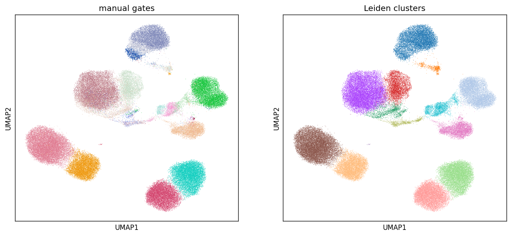

# cytof-qc

QC and unsupervised-clustering benchmark for mass cytometry (CyTOF) data,
run end to end on the public **Levine_13dim** benchmark (Levine et al. 2015,
human bone marrow, 13 markers, 24 manually gated populations).

The pipeline parses raw FCS files, applies the standard arcsinh transform,
runs channel- and population-level QC, Leiden-clusters events through the
scverse toolchain (`anndata` + `scanpy`), and scores the clusters against
the published manual gates.

## Results

- 81,747 gated events, 24 gated populations, 14 Leiden clusters
- Agreement with manual gates: **ARI 0.914, NMI 0.907**
- Mature lineages (T cells, monocytes, NK, B cells, plasma cells) map
  roughly one-to-one onto clusters. The gated progenitor populations
  (HSC, MPP, GMP, MEP, immature B, myelocyte) partially merge. That merge is the
  expected failure mode: progenitor gates overlap in marker space
  and manual gating uses hierarchy the clustering never sees.
- Channel QC flags high negative-event fractions on 9 of 13 channels.
  That is expected for CyTOF after background subtraction. The flags are
  a coarse screen, not a pass/fail gate.
- Only Platelet is flagged sparse (below 20 events).

`results/metrics.json` has the full channel report, per-population
event counts, and a per-population recall/purity table.
`results/population_cluster_heatmap.png` shows which gates split or
merge across clusters.



## Run it

```bash
pip install -r requirements.txt
bash scripts/fetch_data.sh      # ~8 MB from the HDCytoData mirror at UZH
python -m cytof_qc.pipeline     # writes results/metrics.json + figures
python -m pytest tests/ -q      # 11 tests
```

## Layout

- `cytof_qc/io.py`: FCS parsing via `fcsparser`. Channel isotopes are
  renamed to marker names from `$PnN`/`$PnS` metadata. Population labels
  come from the per-gate filenames (`Marrow1_<population>_cells.fcs`).
- `cytof_qc/transform.py`: `arcsinh(x / cofactor)`, cofactor 5.
- `cytof_qc/qc.py`: channel-level negative/zero-event rates and
  per-population event-count flags.
- `cytof_qc/cluster.py`: AnnData -> neighbors -> Leiden -> UMAP.
- `cytof_qc/mapping.py`: ARI/NMI, contingency table, Hungarian
  cluster-to-population matching, per-population recall/purity.
- `cytof_qc/pipeline.py`: the whole run and figure output.

## Honest scope

This is a research-grade benchmark on public reference data. It
demonstrates the standard analysis path (FCS -> transform -> QC ->
cluster -> compare to gates) but is not validated against a clinical or
production gating workflow, and the Leiden clustering is intentionally
unoptimized: no marker weighting and no per-population tuning.
