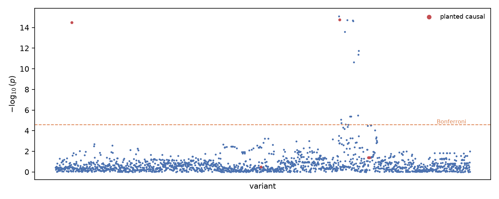
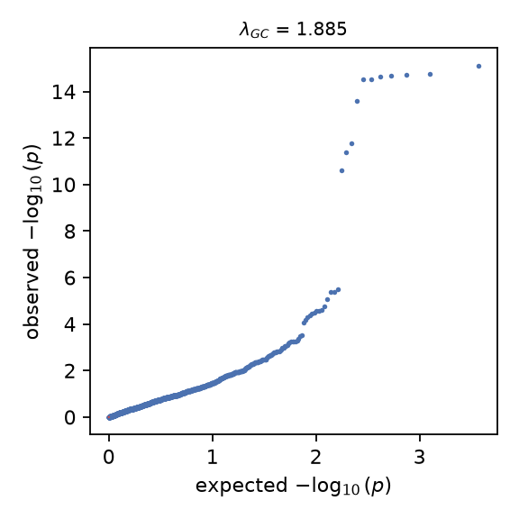

# statgen report

Cohort mode `vcf`; trait `real_genotypes_simulated_trait`. Synthetic and simulated-trait numbers exercise the pipeline and are not genetic findings.

## QC waterfall

2504 -> 2504 samples; 20000 -> 1866 variants.

| filter | axis | removed | kept |
|---|---|---:|---:|
| sample_missingness | sample | 0 | 2504 |
| variant_missingness | variant | 0 | 20000 |
| min_maf | variant | 17142 | 2858 |
| hwe | variant | 992 | 1866 |

## Stratification

10 PCs computed on 1866 variants; PC1 explains 9.1% of genotype variance; 5 ancestry groups capture 4.5% of its variance (eta^2).

## Association

linear test, 1866 variants on 2504 samples with 6 covariates (5 PCs).

Genomic control $\lambda$ = 1.885 with covariates vs 11.656 without; 17 variants pass the Bonferroni threshold 2.68e-05.

Lead hit 22:17003990 (pos 17003990): beta -0.466 (se 0.058), p = 7.75e-16.

Planted causal variants: 2 of 5 surviving QC recovered at Bonferroni (6 planted; 1 failed pooled HWE — the Wahlund effect of mixing groups; beta correlation 0.64.

Of the 17 Bonferroni hits, 15 sit within 250 kb of a planted causal (LD proxies) and 0 are unexplained — marginal tests cannot separate correlated variants, so per-variant attribution needs fine-mapping.

## Limits

Single-marker tests on a small cohort; no LD-aware fine-mapping or imputation. Simulated traits use recorded seeds and planted effects only to exercise recovery.
