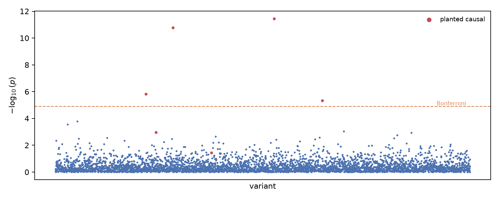
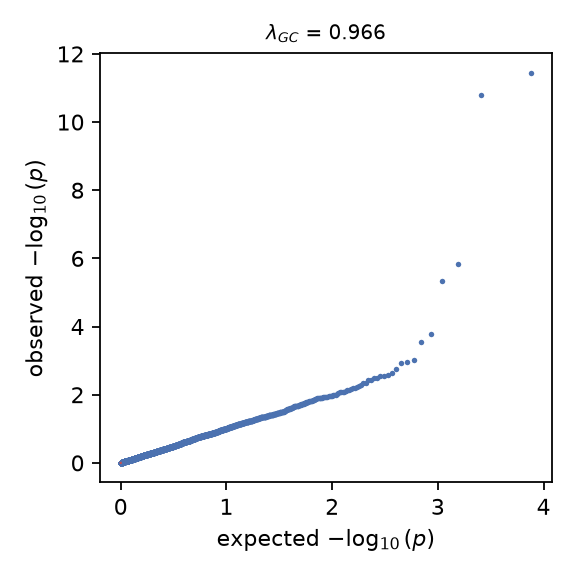

# statgen report

Cohort mode `demo`; trait `synthetic`. Synthetic and simulated-trait numbers exercise the pipeline and are not genetic findings.

## QC waterfall

800 -> 799 samples; 4000 -> 3840 variants.

| filter | axis | removed | kept |
|---|---|---:|---:|
| sample_missingness | sample | 0 | 800 |
| heterozygosity | sample | 1 | 799 |
| variant_missingness | variant | 0 | 4000 |
| min_maf | variant | 23 | 3977 |
| hwe | variant | 137 | 3840 |

## Stratification

10 PCs computed on 3840 variants; PC1 explains 6.0% of genotype variance

Relatedness scan (GRM off-diagonal after projecting out the 10 PCs, so ancestry sharing does not count as relatedness): max 0.079, sd 0.015, 0 pairs above the 0.125 flag. and correlates with the ancestry label at |r| = 1.00.

## Association

linear test, 3840 variants on 799 samples with 4 covariates (2 PCs).

Genomic control $\lambda$ = 0.966 with covariates vs 2.639 without; 4 variants pass the Bonferroni threshold 1.30e-05.

$\lambda$ by covariate PCs: 0 PCs -> 2.628, 1 PCs -> 0.968, 2 PCs -> 0.966. Effect sizes are per copy of the counted allele (a1).

Lead hit rs102113 (pos 2114): beta 0.443 (se 0.063), p = 3.59e-12.

Planted causal variants: 4 of 6 surviving QC recovered at Bonferroni (8 planted; 2 failed pooled HWE — the Wahlund effect of mixing groups; beta correlation 0.99.

Of the 4 Bonferroni hits, 0 are non-causal.

## Limits

Single-marker tests on a small cohort; no LD-aware fine-mapping or imputation. Simulated traits use recorded seeds and planted effects only to exercise recovery.
